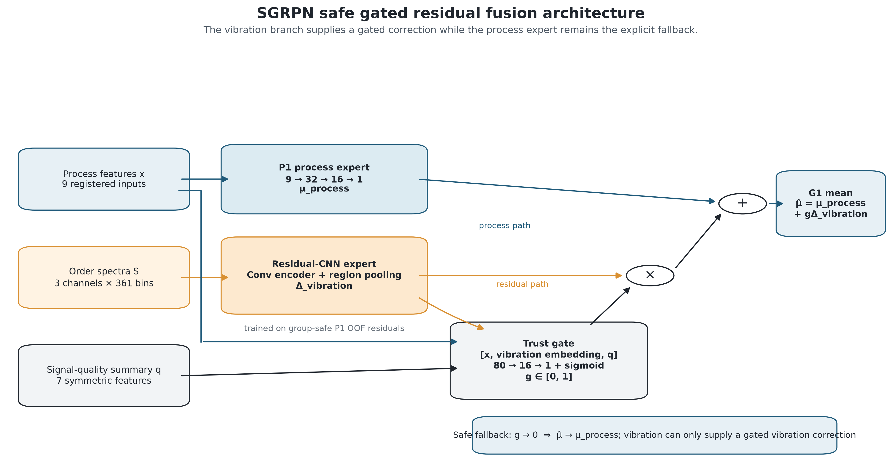
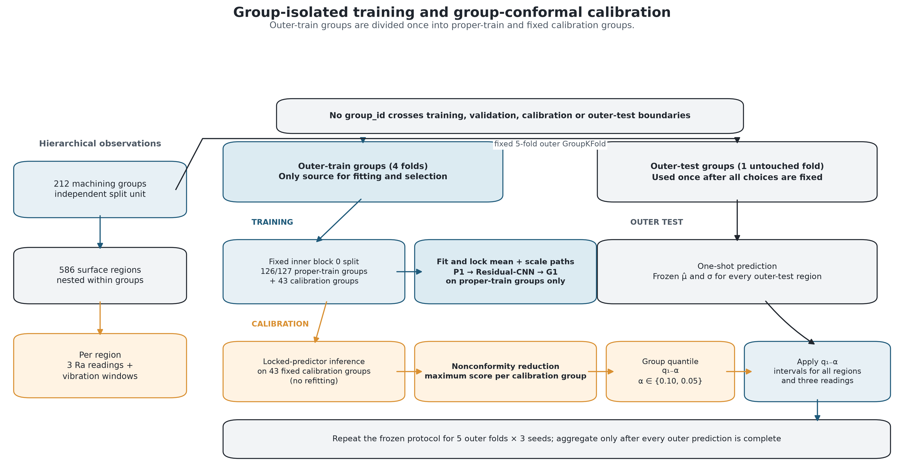
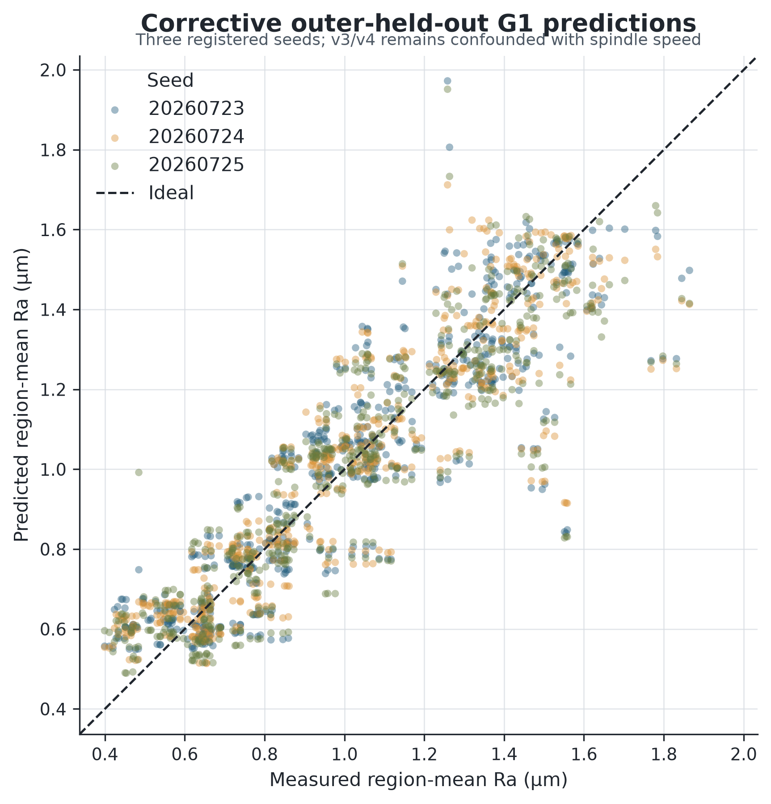
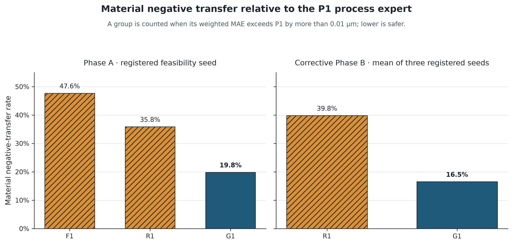
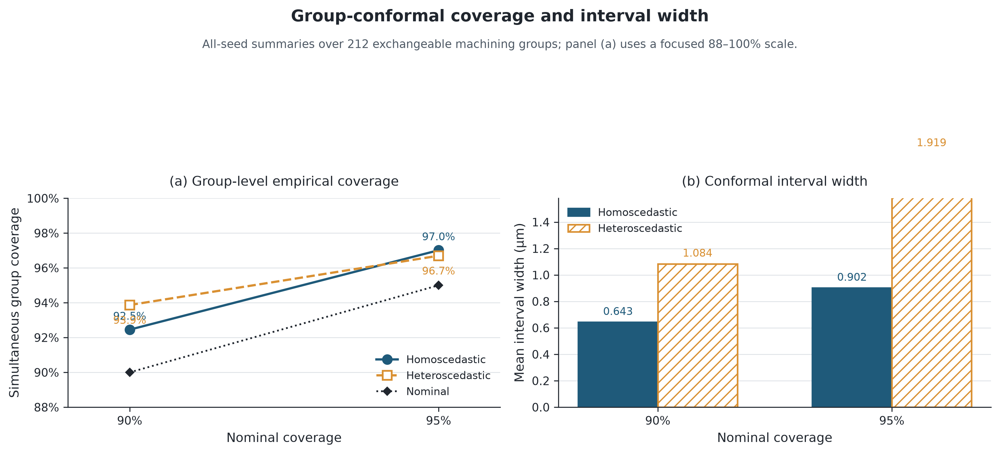
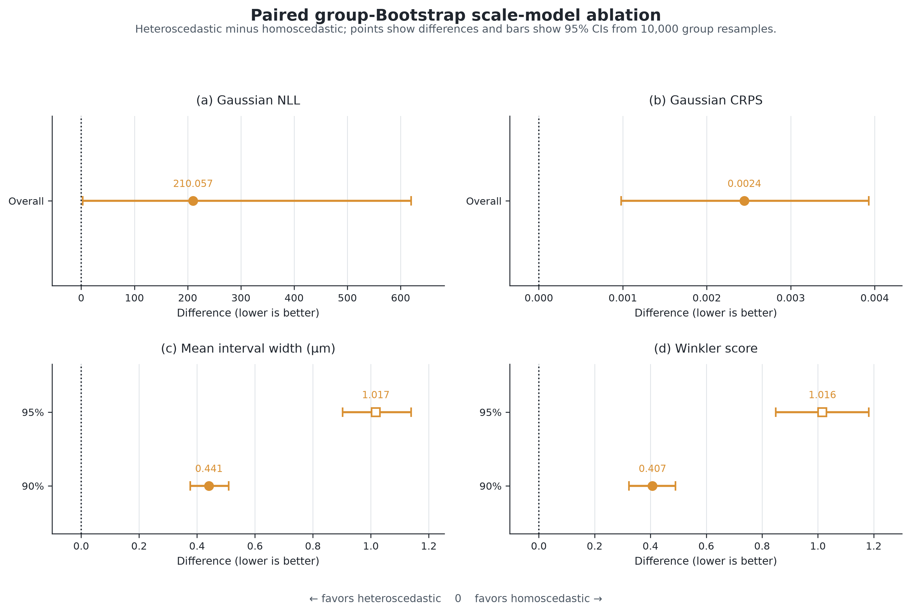

# Safe Gated Residual Neural Fusion with Group Split-Conformal Uncertainty Quantification for Milling Surface Roughness

## Abstract

Programmed cutting parameters often form a strong surface-roughness baseline; vibration may add little and harm individual machining groups. We present a selective gated residual probabilistic network (SGRPN) and group split-conformal framework. The contribution integrates an explicit process fallback, group-cross-fitted vibration residuals, bounded selective fusion, end-to-end group isolation, and simultaneous group-level uncertainty calibration, rather than proposing a new gating primitive or conformal theorem. Evaluation used an existing full-slot milling dataset with 212 machining groups, 586 surface regions, three Ra readings per region, five fixed outer group folds, three model seeds, and 10,000 paired group-Bootstrap resamples. Original Phase B is the primary point-prediction evidence: SGRPN did not establish a stable MAE advantage over the process expert (0.108149 versus 0.108075 μm), but reduced material negative transfer relative to ungated residual fusion (20.91% versus 37.11%). Uncertainty evidence comes only from a frozen post-audit correction. It reserved 43 groups per outer fold exclusively for calibration and used one locked predictor for calibration and testing. Homoscedastic 90% and 95% intervals achieved 92.45% and 97.01% empirical simultaneous-group coverage, with mean widths of 0.643 and 0.902 μm. Heteroscedastic intervals also met both targets but were wider and had worse Winkler scores. The results support selective fusion as group-level risk control and group-aligned conformal calibration for exchangeable new groups of the observed experimental type; they do not establish cross-material or cross-machine transfer.

**Keywords:** surface roughness prediction; milling; selective sensor fusion; negative transfer; group conformal prediction; uncertainty quantification

## 1. Introduction

Surface roughness is a consequential indicator of machining quality because it is associated with contact, wear, fatigue, assembly, and functional performance. Direct roughness metrology remains indispensable for final verification, but it is commonly performed after machining and therefore cannot by itself provide early warning during material removal. This limitation has motivated data-driven virtual sensing: a model uses known cutting conditions and monitored signals to estimate surface roughness before or alongside physical inspection. Reviews spanning classical prediction and recent artificial-intelligence methods show that roughness depends on cutting conditions, tool geometry and wear, material, vibration, sensing arrangement, sample size, and validation design (Benardos & Vosniakos, 2003; Yang et al., 2024; Ko & Yin, 2026).

Two information sources recur in this literature. Programmed process parameters, such as spindle speed, feed, and depth of cut, are low-dimensional and directly tied to the experimental design. Vibration, force, current, sound, and thermal signals can describe the realized process state, but they are high-dimensional, sensitive to sensor placement and operating conditions, and not uniformly informative. Milling dynamics research establishes a physical connection between relative vibration, chatter, surface generation, and process quality, while also showing that forced and self-excited responses depend strongly on the machine–tool–workpiece system (Quintana & Ciurana, 2011; Yue et al., 2019; Wang et al., 2022). Individual prediction studies have reported benefits from combining cutting parameters with vibration (Lin et al., 2020), force (Shang et al., 2023), current (Wang et al., 2025), acceleration (Yao et al., 2024), or heterogeneous time-series and thermal data (Wang & Yan, 2024). These results establish the potential of sensor fusion within the conditions tested by each study; they do not imply that an added modality improves every machining run or validation split. Indeed, a process-only neural model can remain competitive when programmed conditions already explain most observable variation (Lin et al., 2020). The relevant question in a weak-increment setting is therefore not only whether fusion improves an average error score, but also whether the model can limit damage when the sensor correction is unhelpful.

This question is especially important for small, structured machining datasets. Measurements from multiple surface regions of the same machining run share tools, material, programmed conditions, and process history, while repeated profilometer readings from one region share the same underlying surface. A row-wise random split can place correlated observations from one run on both sides of a training or evaluation boundary. The resulting test set then represents another observation from a partially seen run rather than a genuinely new machining group. The same structural issue affects hyperparameter selection, residual construction, and uncertainty calibration: keeping only the final test split group-disjoint is insufficient if intermediate targets or calibration scores were generated with information from the held-out group.

Point accuracy alone also leaves an unresolved decision problem. A prediction error estimate averaged over historical runs does not state how uncertain a new prediction is, nor whether all regions and repeated readings in a future machining group are jointly covered. General approaches include approximate Bayesian dropout, deep ensembles, learned aleatoric scales, and distribution-free calibration (Gal & Ghahramani, 2016; Kendall & Gal, 2017; Lakshminarayanan et al., 2017; Lei et al., 2018). Manufacturing studies have also begun to address this limitation: Zhu et al. (2025) used non-parametric kernel density estimation to form prediction intervals for sensor-based hard-turning models, and He et al. (2026) combined a roughness predictor with adaptive conformal prediction in micro-milling. Consequently, the gap is not the absence of uncertainty quantification or conformal prediction in surface-roughness research. Rather, the unresolved issue addressed here is the combination of (i) potentially harmful weak sensor increments, (ii) end-to-end isolation of machining groups, and (iii) simultaneous prediction coverage for the correlated regions and repeated readings belonging to a new group.

We address this combination with a selective gated residual probabilistic network (SGRPN). A process multilayer perceptron supplies the fallback mean prediction. A convolutional vibration branch learns only cross-fitted residuals of that process expert, and a bounded gate controls the admitted residual correction. The term *safe* is used in a narrow statistical sense: the architecture is designed and evaluated for reducing material negative transfer relative to the process expert under a pre-registered threshold. It does not denote machine functional safety or guarantee improvement for an individual future run. After the mean path is frozen, repeat-aware scale models are fitted and calibrated using one maximum nonconformity score per machining group. The resulting target is simultaneous coverage of all observed-type regions and repeats in an exchangeable new machining group, rather than marginal coverage of an arbitrarily selected row.

The study uses an existing full-slot milling dataset containing 212 machining groups, 586 surface regions, and three Ra readings per region. No additional physical experiment was introduced. Evaluation used fixed five-fold group separation, three random seeds for the retained probability path, and 10,000 paired group-Bootstrap resamples. The main finding is deliberately two-sided: selective gating reduced material negative transfer without establishing a stable mean-accuracy advantage, while both scale variants achieved their empirical simultaneous-group coverage targets after valid split-conformal calibration. The heteroscedastic model was not emphasized because it failed the correction-specific efficiency rule frozen before corrective evaluation.

The contribution is methodological integration and evaluation discipline rather than a claim that any individual component is new. Specifically:

1. We formulate weak-increment vibration fusion as a residual correction with a process-only fallback and quantify its benefit through group-level material negative transfer, rather than assuming that multisensor fusion is uniformly beneficial.
2. We implement a machining-group-isolated protocol that covers outer testing, inner early stopping, cross-fitted residual generation, scale estimation, and a fixed proper-training/calibration split, thereby preventing calibration labels from influencing the locked predictor.
3. We construct group-conformal intervals using the maximum standardized error within each calibration group, targeting simultaneous coverage for all observed-type regions and repeats in an exchangeable new machining group.
4. We report a frozen post-audit corrective comparison rather than presenting the reused-data analysis as untouched confirmation. Both scale variants met the tested empirical coverage targets, but the input-dependent scale produced wider intervals and worse efficiency scores; both are retained, while heteroscedastic superiority is not foregrounded.

These elements are established individually in prior work. Their contribution here is the failure-conscious, group-aware synthesis needed to evaluate weak-increment vibration fusion without converting nested observations into pseudo-replication or presenting calibration from a predictor inconsistent with the tested model.

## 2. Related Work

### 2.1 Data-driven surface-roughness prediction

Data-driven roughness models can be organized by the information available at prediction time. Process-only models use programmed cutting conditions and sometimes tool or material descriptors. Their compact inputs, low acquisition burden, and direct connection to designed experiments make them strong baselines, especially when datasets contain only hundreds of independent runs. Reviews by Benardos and Vosniakos (2003), Yang et al. (2024), and Ko and Yin (2026) show that regression, support-vector methods, tree ensembles, artificial neural networks, and deep models have all been used across turning, milling, grinding, drilling, and precision-machining settings. The diversity of reported methods and datasets also cautions against inferring a general algorithm ranking from results obtained under different materials, ranges, and split units.

Sensor-based models seek information about the realized machining state that is not fully encoded by programmed conditions. Lin et al. (2020) modeled end-milling roughness from cutting parameters and measured vibration using regression and multilayer perceptrons; their comparisons illustrate both the usefulness of a process-only nonlinear baseline and the condition-dependent benefit of adding vibration. Shang et al. (2023) fused force features with machining parameters in an extreme-learning-machine model for ultra-precision milling. Yao et al. (2024) combined compensated acceleration features, process effects, and an extreme learning machine to estimate roughness along continuous cutting positions. These studies motivate the use of dynamic signals but address point prediction within their respective experimental settings. The physical literature separately shows that chatter, forced vibration, runout, process damping, and structural dynamics can affect surface generation, but a spindle measurement is not a direct measurement of tool-tip displacement and its predictive value remains setup-dependent (Quintana & Ciurana, 2011; Yue et al., 2019; Wang et al., 2022).

Recent deep models move from hand-selected descriptors toward learned heterogeneous representations. Wang and Yan (2024) separately encoded structured time-series features and thermal imagery before neural fusion for online milling-surface monitoring. Wang et al. (2025) combined current signals with static process data using multiscale convolution, bidirectional recurrent layers, and attention. Such architectures demonstrate how heterogeneous sources can be aligned and fused, but increased representational capacity also raises the data requirement and the possibility that a weak or shifted modality contaminates a strong baseline. Accordingly, the present study does not treat architectural depth as an independent contribution and does not claim that deep learning is generally superior to classical models.

### 2.2 Selective fusion and negative-transfer control

Learned gates provide one mechanism for making fusion input-dependent. The gated multimodal unit of Arevalo et al. (2017) used multiplicative gates to regulate the influence of different modalities on an internal representation. In manufacturing, the risk that fusion performs worse than a constituent source has recently been discussed explicitly in multisource bearing diagnosis; Gao et al. (2026) termed this outcome fusion negative transfer and proposed a multistage suppression framework for acoustic and vibration signals. That work concerns fault classification rather than roughness regression, but it supports the broader premise that sensor fusion should be evaluated against the sources it augments instead of being presumed beneficial.

Our use of *negative transfer* is operational and does not invoke a source-to-target domain-adaptation claim. For each machining group, it is the increase in mean absolute error of a fusion candidate relative to the process neural expert, with material harm defined by a threshold fixed before formal evaluation. SGRPN also differs from representation-level gated fusion: the process prediction remains an explicit fallback, the vibration branch predicts a cross-fitted process residual, and the gate scales only that correction. The learned gate is therefore a model coefficient, not a calibrated probability that vibration is physically trustworthy.

Within the bounded roughness literature verified for this study, representative fusion papers primarily optimize and compare aggregate predictive accuracy (Shang et al., 2023; Yao et al., 2024; Wang & Yan, 2024; Wang et al., 2025). We do not interpret that observation as proof that no earlier work examined harmful fusion. Instead, it motivates the narrower empirical contribution tested here: reporting how often fusion materially worsens a group, comparing direct, residual, and gated fusion under the same group splits, and retaining the absence of a stable mean-accuracy gain.

### 2.3 Uncertainty quantification for manufacturing prediction

Prediction intervals can be produced through assumptions about a residual distribution, approximate Bayesian inference, ensembles, density estimation, resampling, or post-hoc calibration. These approaches answer different questions and should not be conflated. Monte Carlo dropout approximates Bayesian model uncertainty (Gal & Ghahramani, 2016), deep ensembles estimate predictive uncertainty through independently trained networks (Lakshminarayanan et al., 2017), and learned input-dependent scales target aleatoric variation (Kendall & Gal, 2017). The hard-turning study of Zhu et al. (2025) assessed combinations of vibration, sound, signal processing, and regression models, then formed non-parametric kernel-density prediction intervals and evaluated coverage and width. This is direct evidence that recent surface-quality research extends beyond point metrics. However, an interval evaluated per held-out sample is not automatically a simultaneous interval for all correlated observations in a new machining run.

Conformal prediction offers a model-agnostic calibration layer. Under the relevant exchangeability conditions, calibration nonconformity scores can turn a fitted point or distributional predictor into finite-sample marginal prediction sets without specifying a parametric outcome distribution (Lei et al., 2018; Angelopoulos & Bates, 2023). Adaptive widths can be obtained by conformalizing quantile or scale models, but calibration protects coverage rather than guaranteeing that the underlying heteroscedastic ranking is efficient (Romano et al., 2019). The guarantee attaches to the chosen sampling unit and score; it is not a license to ignore dependence or arbitrary distribution shift. Weighted and nonexchangeable extensions require additional assumptions or robustness constructions (Tibshirani et al., 2019; Barber et al., 2023), and recent surveys emphasize that structured, hierarchical, and dynamic data require their collection structure to be reflected in the conformal design (Zhou et al., 2026).

Surface-roughness research has already begun using conformal methods. He et al. (2026) combined ensemble-based mean prediction, residual correction, adaptive conformal intervals, and uncertainty-aware optimization for micro-milling. This directly rules out a novelty claim based only on applying conformal prediction to roughness. The present study instead asks a different calibration question: whether one interval construction can cover every retained region and all three readings from a new machining group, while the mean-fusion path and its failure modes are evaluated under the same group-isolated protocol.

### 2.4 Hierarchical conformal prediction and the remaining gap

Classical split conformal prediction is commonly introduced for exchangeable observation-level examples (Lei et al., 2018; Angelopoulos & Bates, 2023). Machining data with several regions and repeated readings per run are hierarchical: observations within a group may be dependent, and groups may differ in their latent distributions. Dunn et al. (2023) showed that ordinary observation-level exchangeability does not hold automatically when grouped observations arise from distinct group distributions and developed distribution-free procedures for two-layer hierarchical data. Zhou et al. (2026) likewise identify hierarchical structure as a setting in which conformal methods must align their exchangeability assumptions and scores with the data-generating structure. These results do not imply validity under unrestricted domain shift; they clarify why the group, rather than an individual reading, must be the calibration and inferential unit for the present deployment question.

The reviewed evidence leaves a specific intersection insufficiently resolved. Roughness studies demonstrate process baselines, signal models, and increasingly sophisticated fusion (Lin et al., 2020; Shang et al., 2023; Yao et al., 2024; Wang & Yan, 2024; Wang et al., 2025); recent work supplies KDE or conformal uncertainty intervals (Zhu et al., 2025; He et al., 2026); and statistical literature supplies principles for distribution-free and hierarchical calibration (Lei et al., 2018; Dunn et al., 2023; Angelopoulos & Bates, 2023; Zhou et al., 2026). What is not supplied by any one of these components is an end-to-end experiment that jointly (i) preserves a strong process fallback when vibration has weak incremental value, (ii) measures material fusion harm at the machining-group level, (iii) isolates groups through residual generation, model selection, and calibration, and (iv) targets simultaneous coverage of multiple regions and repeated readings in a new group. SGRPN is evaluated as an application-level synthesis of these requirements, not as a new general conformal theorem and not as evidence of unconditional cross-material or cross-machine generalization.

## 3. Experimental Data and Problem Formulation

### 3.1 Milling experiment and hierarchical observations

The study used an existing full-slot milling dataset acquired on Al 6061-T6 workpieces with a 10-mm, three-flute end mill under up-milling conditions and coolant use. The measured surface was the slot bottom. Surface roughness was measured using a contact profilometer at feed-direction positions of \(X=45\), \(75\), and \(105\) mm, with a recorded sampling length of 0.8 mm. Each spatial measurement region was aligned one-to-one with a corresponding vibration segment. The instrument model, stylus direction, evaluation length, and cutoff length were not available in the archived experimental record and are therefore not inferred here.

The dataset contains 212 independent machining groups, denoted by \(g=1,\ldots,G\), and 586 surface regions nested within those groups. Each region has three repeated arithmetic-roughness readings, \(y_{gir}\), where \(i\) indexes the region within group \(g\) and \(r\in\{1,2,3\}\) indexes the repeat. The region-level target used by the mean models was

\[
\bar y_{gi}=\frac{1}{3}\sum_{r=1}^{3}y_{gir}.
\]

The machining inputs were spindle speed \(n\), feed per tooth \(f_z\), and axial depth of cut \(a_p\). The design grid comprised ten speed levels from 4,000 to 8,500 rpm in 500-rpm increments, five feed levels from 0.03 to 0.15 mm/tooth in 0.03-mm/tooth increments, and four depth levels from 0.5 to 2.0 mm in 0.5-mm increments. Of the 200 possible process combinations, 189 were observed. The archived data included two acquisition versions, v3 and v4. Because these versions used non-overlapping speed grids, version and speed were completely confounded. Version was therefore excluded from all model inputs and used only for a descriptive composite-domain stress test.

Three spindle-vibration channels—Ch9, Ch10, and Ch11—were sampled at 25.6 kHz. Ch11 was confirmed as the axial direction. The physical X/Y assignment of Ch9 and Ch10 could not be recovered reliably, so the two horizontal channels were treated symmetrically rather than assigned unsupported directional labels. Each valid model window covered 1 s and therefore contained 25,600 samples. The core dataset and hierarchy are summarized in [Table 1](assets_corrective/tables.md#table-1-dataset-and-experimental-structure).

### 3.2 Group-balanced estimand

Several regions can originate from the same machining group. Treating all regions as independent and equally weighted would allow groups with more retained regions to dominate the objective. If group \(g\) contains \(m_g\) regions, each region was assigned weight

\[
w_{gi}=\frac{1}{m_g},
\]

so that \(\sum_i w_{gi}=1\) for every group. Point-prediction metrics, model losses, and single-reading probability metrics used these region weights. Group-level simultaneous coverage instead assigned one binary coverage outcome to each machining group. This distinction makes the primary estimand the performance for an exchangeable new machining group of the existing experimental type, rather than the performance for a randomly selected, nominally independent region.

The fixed outer evaluation consisted of five mutually exclusive group folds. All regions, signal windows, and repeated Ra readings associated with one group remained in the same outer fold. The observed overlap in group identifiers between outer folds was zero. Phase A used the single pre-registered seed 20260723 to screen the mean architecture. Phase B repeated the retained mean and uncertainty paths with seeds 20260723, 20260724, and 20260725.

### 3.3 Prediction objectives

The first objective was to estimate the mean roughness \(\bar y_{gi}\) from process parameters and vibration while controlling the risk that a weak or unstable vibration contribution worsens predictions relative to a process-only expert. For a candidate fusion model \(c\) and the process neural baseline P1, the group-wise change in mean absolute error was defined as

\[
d_g^{(c)}=\operatorname{MAE}_{g}^{(c)}-\operatorname{MAE}_{g}^{(\mathrm{P1})}.
\]

A group was designated as showing *material negative transfer* when \(d_g^{(c)}>0.01~\mu\text{m}\). This value was frozen before Phase A results were interpreted as an operational deadband that prevents negligible numerical differences from being counted as material harm. It was not derived from instrument accuracy, a universal roughness tolerance, a power calculation, or an economic loss function; those interpretations are explicitly excluded.

The second objective was probabilistic: construct prediction intervals for the individual repeated Ra readings while respecting the nested dependence among repeats, regions, and machining groups. The principal coverage target was simultaneous coverage of all observed-type regions and all three readings within a new machining group. Single-reading coverage was retained as a secondary diagnostic, not as a substitute for the group-level target.

## 4. Method

### 4.1 Overview of SGRPN

The proposed selective gated residual probabilistic network (SGRPN) separates the prediction problem into three roles: a process-only neural expert supplies the safe mean path, a vibration encoder proposes a residual correction, and a gate determines how much of that correction is admitted. Probability-scale models are trained only after the mean path is frozen. For the valid corrective uncertainty analysis, the same locked mean and scale predictor is then applied to a fixed, disjoint calibration set and to the outer-test set. Figure 1 shows the architecture.

*Figure 1. SGRPN architecture. A process MLP provides the fallback prediction; an order-spectrum CNN learns a residual correction; and a bounded gate controls the admitted correction. The mean path is frozen before homoscedastic or heteroscedastic scale estimation and group-conformal calibration.*

This decomposition was selected for the observed weak-increment regime. It does not require vibration to improve every group. Instead, it permits the mean predictor to approach the process expert when the learned correction is unsupported. The gate is an internal correction coefficient and is not interpreted as a probability that the signal is physically reliable.

### 4.2 Process expert

The process vector was expanded into the registered nine-dimensional quadratic basis

\[
\mathbf{x}_{gi}=
[n,f_z,a_p,n^2,f_z^2,a_p^2,nf_z,na_p,f_za_p]^{\mathsf T}.
\]

Every standardizer was fitted only on the applicable training groups. P1 mapped the standardized vector through layers \(9\rightarrow32\rightarrow16\rightarrow1\), using ReLU activations and dropout 0.10 after the first hidden layer. Its prediction is denoted by

\[
\mu_{gi}^{(p)}=f_p(\mathbf{x}_{gi}).
\]

P1 served both as an independently evaluated neural comparator and as the fallback expert of the fusion models. A quadratic ridge-regression model using the same registered process terms, M0, was retained as a strong classical comparator and loaded read-only from the established evaluation path.

### 4.3 Order-spectrum vibration representation

For each complete 1-s window and channel, the signal was centered, multiplied by a Hann window, and transformed with a one-sided real Fourier transform. Let \(f\) be frequency in hertz. The frequency axis was converted to rotational order through

\[
o=\frac{f}{n/60}.
\]

The log power, \(\log(1+P(f))\), was linearly interpolated onto a fixed 0–90-order grid with spacing 0.25, producing 361 bins per channel. Spectrum scaling was estimated from the current training groups only. The three-channel order spectrum passed through a shared one-dimensional CNN with channel widths 16, 32, and 64, kernel sizes 7, 5, and 3, stride 2 at each convolution, batch normalization, ReLU activations, and adaptive average pooling. Masked mean pooling across valid windows produced a 64-dimensional region embedding \(\mathbf{z}_{gi}\).

Because the two horizontal axes were unresolved, Ch9 and Ch10 were exchanged with probability 0.5 during training. At inference, predictions from the original and exchanged orders were averaged. Ch11 was never exchanged. The gate also received seven deterministic signal-quality summaries: the mean and maximum horizontal log-RMS, the mean and maximum horizontal normalized spectral entropy, axial log-RMS, axial normalized spectral entropy, and the valid-window fraction. Horizontal summaries were symmetric under channel exchange.

### 4.4 Out-of-fold residual expert and selective gate

The vibration expert did not learn the Ra target directly in the retained residual models. Within each outer training set, a four-fold group cross-fitting procedure generated process predictions for groups not used to fit the corresponding P1 instance. The residual target was

\[
r_{gi}^{\mathrm{OOF}}=\bar y_{gi}-\mu_{gi}^{(p,\mathrm{OOF})}.
\]

A residual head mapped the 64-dimensional vibration embedding through \(64\rightarrow32\rightarrow1\), with ReLU and dropout 0.10, to produce \(\Delta_{gi}^{(v)}\). This cross-fitted target prevents the vibration branch from learning residuals produced by an in-sample process fit.

For G1, the gate received the concatenation of the nine process features, the 64-dimensional vibration embedding, and the seven quality features. An \(80\rightarrow16\rightarrow1\) network with ReLU and sigmoid activations produced

\[
g_{gi}\in[0,1].
\]

The SGRPN mean was

\[
\hat\mu_{gi}=\mu_{gi}^{(p)}+g_{gi}\Delta_{gi}^{(v)}.
\]

Thus, \(g_{gi}\rightarrow0\) suppresses the residual and returns the process prediction, whereas \(g_{gi}\rightarrow1\) admits the full vibration correction. P1 and the residual expert were frozen while fitting the gate. The weighted training objective was

\[
\mathcal L=
\mathcal L_{\mathrm{Huber}}(\hat\mu,\bar y;\delta=0.10)
+10^{-3}\operatorname{E}[g^2]
+10^{-2}\operatorname{E}[(g\Delta^{(v)})^2].
\]

The two regularizers discourage an always-open gate and unnecessarily large corrections. They do not force any predetermined gate distribution.

### 4.5 Repeat-aware predictive scale

After mean-model fitting, all mean-path parameters were frozen. Two scale models were evaluated. The homoscedastic model learned one positive global scale. The heteroscedastic model concatenated the nine process features, 64-dimensional vibration embedding, seven quality features, the gate value, and the absolute admitted correction into an 82-dimensional input. It used layers \(82\rightarrow32\rightarrow16\rightarrow1\), with ReLU hidden activations, and produced

\[
\sigma_{gi}=\operatorname{softplus}(h(\cdot))+10^{-4}.
\]

Both scales were trained by minimizing the region-weighted Gaussian negative log-likelihood averaged over the three readings:

\[
\mathcal L_{\mathrm{NLL}}=
\frac{1}{\sum_{g,i}w_{gi}}
\sum_{g,i}w_{gi}
\left[
\frac{1}{3}\sum_{r=1}^{3}
\left(
\log\sigma_{gi}+\frac{(y_{gir}-\hat\mu_{gi})^2}{2\sigma_{gi}^2}
\right)
\right],
\]

up to the constant Gaussian term. Here, \(\sigma_{gi}\) denotes conditional predictive dispersion combining repeat variation and unmodeled error. The three readings do not support a Gauge R&R decomposition, so \(\sigma_{gi}\) is not interpreted as instrument precision, pure measurement error, or an isolated process-variance component.

### 4.6 Group-conformal calibration

Conformal calibration was performed separately for each outer fold, seed, and scale model using a fixed group split. Within each outer-training universe, the existing four-way group partition generated with seed 20260723 was reused: validation block 0 was reserved as the calibration set and blocks 1–3 formed the proper-training set. This produced 43 calibration groups in every outer fold, 126 proper-training groups in folds 0–1, and 127 proper-training groups in folds 2–4. The split was identical across the three model seeds. All mean components, scale models, feature scalers, and training-length choices were fitted using proper-training groups only. The resulting predictor was locked before any calibration label was used.

The locked predictor generated both calibration and outer-test predictions. For every repeated calibration reading, the normalized nonconformity score was

\[
s_{gir}=\frac{|y_{gir}-\hat\mu_{gi}|}{\hat\sigma_{gi}}.
\]

Each calibration group contributed exactly one score,

\[
S_g=\max_{i\in g,\ r\in\{1,2,3\}}s_{gir},
\]

thereby retaining the dependence among regions and repeats. With \(G_{\mathrm{cal}}=43\) calibration groups and target miscoverage \(\alpha\), the finite-sample corrected rank was

\[
k=\left\lceil(G_{\mathrm{cal}}+1)(1-\alpha)\right\rceil,
\]

and \(q_{\alpha}\) was the \(k\)-th ordered group score without interpolation. The calibrated interval for every reading in test region \(i\) was

\[
C_{gi}^{(\alpha)}=
[\hat\mu_{gi}-q_{\alpha}\hat\sigma_{gi},
 \hat\mu_{gi}+q_{\alpha}\hat\sigma_{gi}].
\]

The procedure targets marginal simultaneous coverage for a new exchangeable machining group of the existing type. It does not assert conditional coverage for arbitrary process settings, nor protection under unrestricted material, tool, or acquisition-domain shifts.

### 4.7 Group-isolated nested fitting

The complete fitting and evaluation sequence is shown in Figure 2. In each outer fold, all model fitting and selection occurred inside the proper-training role. Existing inner group splits could be used within that role for epoch selection and group-cross-fitted residual construction, but the 43 calibration groups could not contribute to fitting, feature scaling, model choice, or stopping. When G1 was trained within a nested context, its upstream P1 and residual models were rebuilt from the applicable proper-training universe rather than reused from a broader data universe. After the mean and both scale paths were locked, the calibration groups supplied the group-maximum scores and the untouched outer fold was predicted once.

*Figure 2. Group-isolated proper training, fixed calibration, and outer testing. Machining groups, rather than regions or readings, are the indivisible split and resampling units. The same locked predictor generates calibration and outer-test predictions; each calibration group contributes one maximum score.*

This group isolation was applied consistently to feature scaling, early stopping, residual generation, scale fitting, and calibration. Consequently, correlated regions and repeated measurements from a machining run could not occur on both sides of any fitted transformation or evaluated prediction.

## 5. Experimental Design

### 5.1 Comparator matrix

The pre-registered comparator set is summarized in [Table 2](assets_corrective/tables.md#table-2-registered-model-and-comparator-matrix). M0 was the quadratic process ridge baseline. P1 tested whether a compact neural process expert remained credible relative to M0. V1 used only the order-spectrum CNN and measured the standalone predictive content of vibration. F1 directly concatenated process features and the vibration embedding. R1 added the complete cross-fitted vibration residual to P1 without gating. G1 applied the selective gate to the same residual path. V1, F1, R1, and G1 used the same order-spectrum representation, CNN capacity, outer folds, and group-balanced region weights.

### 5.2 Two-phase registered protocol

Phase A evaluated all six models with seed 20260723. The process expert was required to have no more than 5% worse weighted MAE than M0 and an \(R^2\) decrease no larger than 0.02. G1 was required to have no more than 1% worse MAE, no more than 3% worse RMSE, and no lower \(R^2\) than P1. Conditional on this noninferiority gate, Phase B could proceed through either of two pre-registered paths: (i) at least 1% MAE improvement over P1 with improvement in at least three of five outer folds, or (ii) a reduction of at least 10 percentage points in material negative-transfer rate relative to both F1 and R1.

Phase B retained P1, R1, and G1 and repeated their mean fitting under all three registered seeds. No favorable Phase A initialization was selected. These original Phase B point results remain the historical primary evidence for mean prediction and negative transfer.

During an independent methodological audit, the initial cross-fitted conformal analysis was found to violate the identical-predictor requirement: its calibration predictions and outer-test predictions did not come from one locked predictor. Those interval results are not used in this manuscript. Before any corrective model was trained or any corrective outcome was inspected, a post-audit group split-conformal protocol fixed the proper-training/calibration roles, retained the five outer folds and all three seeds, prohibited result-driven rerunning, and required both scale variants to remain reported. This corrective analysis reuses the same dataset and is therefore described as corrective empirical evidence, not as an independent replication or publicly preregistered confirmation. Its reduced-proper-training mean results are reported separately as the cost of reserving independent calibration groups.

The correction-specific decision rule was frozen before corrective evaluation. Heteroscedasticity could be emphasized only if it reached both empirical simultaneous-group coverage targets and achieved strictly lower conformal Winkler scores than the homoscedastic alternative at both 90% and 95%. No numerical threshold for practically acceptable interval width was registered; widths are reported without an industrial adequacy claim.

### 5.3 Optimization and reproducibility controls

All trainable mean components used the group-balanced Huber objective with \(\delta=0.10~\mu\text{m}\) and AdamW. The learning rates were \(10^{-3}\) for P1 and the gate and \(3\times10^{-4}\) for the vibration branch. Scale models used AdamW with learning rate \(10^{-3}\). Weight decay was \(10^{-4}\), the maximum training length was 200 epochs, patience was 20 epochs, and the batch size was eight. Training was deterministic under each registered seed. Fold identity, model configuration, data identity, and completion fingerprints were stored with the artifacts; a completed unit could be resumed only when all fingerprints matched.

### 5.4 Evaluation metrics and group-wise inference

Point prediction was evaluated with group-balanced region-weighted MAE, RMSE, and \(R^2\). Fold-win counts were reported in the single-seed Phase A screen. Material negative transfer used the pre-registered \(0.01~\mu\text{m}\) operational excess in group MAE relative to P1. For probability evaluation, the analysis reported Gaussian NLL, Gaussian continuous ranked probability score (CRPS), single-reading coverage, simultaneous group coverage, mean interval width, and the Winkler interval score at nominal 90% and 95% levels. CRPS and interval scores are proper scoring rules that evaluate distributional or interval forecasts jointly rather than rewarding coverage alone (Gneiting & Raftery, 2007).

Uncertainty in paired model differences was evaluated with 10,000 group-level paired Bootstrap replicates. Each replicate sampled complete machining groups and retained every nested region and reading. For the Phase B mean comparisons, all three seed predictions belonging to a sampled group were preserved together. A positive value in the reported MAE-improvement column denotes lower candidate MAE; for the scale ablation, differences were computed as heteroscedastic minus homoscedastic, and all evaluated scale metrics were lower-is-better.

## 6. Results

### 6.1 Point prediction: a credible process expert but no stable mean advantage from fusion

Table 3 separates the historical primary point-prediction evidence from the reduced-proper-training results produced only to support valid split calibration.

**Table 3. Point prediction and material negative transfer. Panel A contains the primary Phase A and original Phase B evidence; Panel B reports the post-audit reduced-proper-training path and does not replace Panel A.**

**Panel A. Historical primary point-prediction evidence**

| Phase | Model | Reference | MAE (μm) | RMSE (μm) | \(R^2\) | Fold wins | Material negative transfer | MAE improvement (μm) [95% CI] |
| --- | --- | --- | ---: | ---: | ---: | ---: | ---: | --- |
| Phase A | M0 | — | 0.104619 | 0.142870 | 0.826172 | — | — | — |
| Phase A | P1 | M0 | 0.107735 | 0.147107 | 0.815708 | 1/5 | — | -0.003116 [-0.008250, 0.001994] |
| Phase A | V1 | P1 | 0.175927 | 0.233567 | 0.535420 | 0/5 | 69.34% | -0.068192 [-0.086720, -0.050499] |
| Phase A | F1 | P1 | 0.119040 | 0.167782 | 0.760267 | 1/5 | 47.64% | -0.011305 [-0.022760, -0.000647] |
| Phase A | R1 | P1 | 0.110505 | 0.147564 | 0.814561 | 2/5 | 35.85% | -0.002770 [-0.009456, 0.003620] |
| Phase A | G1 | P1 | 0.106314 | 0.145085 | 0.820740 | 2/5 | 19.81% | 0.001421 [-0.002421, 0.005166] |
| Original Phase B | P1 | — | 0.108075 | 0.147046 | 0.815846 | — | — | — |
| Original Phase B | R1 | P1 | 0.112636 | 0.150994 | 0.805644 | — | 37.11% | -0.004561 [-0.010636, 0.001247] |
| Original Phase B | G1 | P1 | 0.108149 | 0.145847 | 0.818749 | — | 20.91% | -0.000074 [-0.003133, 0.002817] |

**Panel B. Post-audit reduced-proper-training results**

| Phase | Model | Reference | MAE (μm) | RMSE (μm) | \(R^2\) | Material negative transfer | MAE improvement (μm) [95% CI] |
| --- | --- | --- | ---: | ---: | ---: | ---: | --- |
| Corrective Phase B | P1 | — | 0.110062 | 0.149093 | 0.810691 | — | — |
| Corrective Phase B | R1 | P1 | 0.117848 | 0.160213 | 0.781365 | 39.78% | -0.007786 [-0.014117, -0.002202] |
| Corrective Phase B | G1 | P1 | 0.111377 | 0.152889 | 0.800881 | 16.51% | -0.001314 [-0.005814, 0.001927] |

Positive MAE improvement denotes lower candidate MAE. Material negative transfer uses the frozen \(0.01~\mu\text{m}\) group-MAE excess threshold. In Phase A, M0 achieved MAE \(0.104619~\mu\text{m}\), RMSE \(0.142870~\mu\text{m}\), and \(R^2=0.826172\). P1 achieved MAE \(0.107735~\mu\text{m}\), RMSE \(0.147107~\mu\text{m}\), and \(R^2=0.815708\). Its MAE was 2.98% higher than M0 and its \(R^2\) was lower by 0.0105, satisfying the registered credibility limits but not supporting superiority over the classical baseline.

G1 achieved the best Phase A neural MAE, \(0.106314~\mu\text{m}\), with RMSE \(0.145085~\mu\text{m}\) and \(R^2=0.820740\). However, it improved on P1 in only two of five outer folds. Its MAE improvement over P1 was \(0.001421~\mu\text{m}\), with a paired group-Bootstrap 95% interval of \([-0.002421,0.005166]~\mu\text{m}\). The interval included zero, and the fold criterion for the registered mean-improvement path was not met.

The three-seed original Phase B replication reinforced this interpretation. Mean MAE was \(0.108075~\mu\text{m}\) for P1 and \(0.108149~\mu\text{m}\) for G1. The G1 improvement estimate was \(-0.000074~\mu\text{m}\), with a 95% interval of \([-0.003133,0.002817]~\mu\text{m}\). Although G1 had a slightly lower mean RMSE (\(0.145847\) versus \(0.147046~\mu\text{m}\)) and a slightly higher mean \(R^2\) (0.818749 versus 0.815846), the registered primary MAE analysis showed no stable average advantage. The interval upper bound also excludes an average improvement as large as \(0.005~\mu\text{m}\) under the adopted resampling analysis, while improvements smaller than \(0.002817~\mu\text{m}\) remain compatible with the data. This is a precision statement, not a formal equivalence claim, because no engineering equivalence margin was registered.

Reserving 43 calibration groups in the corrective protocol reduced the data available for fitting. Under this reduced proper-training path, P1 and G1 obtained MAEs of \(0.110062\) and \(0.111377~\mu\text{m}\), respectively; the G1 improvement estimate was \(-0.001314~\mu\text{m}\), with a 95% interval of \([-0.005814,0.001927]~\mu\text{m}\). This result is reported as the cost of valid split calibration and does not replace the original Phase B point-prediction evidence. Figure 3 visualizes the corrective outer-held-out G1 predictions.

*Figure 3. Corrective outer-held-out G1 predictions against measured region-mean Ra across the three registered seeds. The v3/v4 stress test remains confounded with speed; version is not used as a model input or visual grouping variable.*

These results place the contribution of G1 in fusion safety rather than in a claim of higher average point accuracy.

### 6.2 Selective gating reduced material negative transfer

Direct and ungated use of vibration produced substantial group-level deterioration. In Phase A, the material negative-transfer rates were 69.34% for vibration-only V1, 47.64% for direct fusion F1, and 35.85% for ungated residual fusion R1. Selective gating reduced this rate to 19.81%. Relative to F1 and R1, the reductions were 27.83 and 16.04 percentage points, respectively, exceeding the registered 10-percentage-point requirement for both comparisons. This transfer-safety path, rather than the unmet mean-improvement path, authorized Phase B.

Across the three original Phase B seeds, material negative transfer remained lower for G1 than for R1: 20.91% versus 37.11%, a reduction of 16.19 percentage points. The mean MAE for R1 was \(0.112636~\mu\text{m}\), compared with \(0.108149~\mu\text{m}\) for G1 and \(0.108075~\mu\text{m}\) for P1. The corrective reduced-proper-training path showed the same direction: 16.51% for G1 versus 39.78% for R1, while their MAEs were \(0.111377\) and \(0.117848~\mu\text{m}\), respectively. Thus, suppressing selected residual corrections helped avoid the broader degradation observed when every vibration correction was admitted.

*Figure 4. Material negative-transfer rate relative to P1. A group is counted when candidate group MAE exceeds P1 group MAE by more than \(0.01~\mu\text{m}\). Phase A shows the registered fusion comparators; the corrective panel summarizes the three registered seeds under the independent calibration split.*

The corrective G1 gate distribution also showed active selectivity rather than collapse. The overall median was 0.3053, with 5th and 95th percentiles of 0.0499 and 0.7299. These values show that the learned model used a range of admitted correction strengths. They do not establish a physical sensor-reliability probability or a causal mechanism for when vibration is informative.

### 6.3 Corrective group split-conformal intervals achieved the empirical coverage targets

The all-seed corrective probability results are given in Table 4 and Figure 5.

**Table 4. All-seed post-audit group split-conformal results.**

| Scale model | Nominal level | Single-reading coverage | Simultaneous-group coverage | Mean width (μm) | Winkler score | Gaussian NLL | Gaussian CRPS |
| --- | ---: | ---: | ---: | ---: | ---: | ---: | ---: |
| Homoscedastic | 90% | 95.18% | 92.45% | 0.643449 | 0.788720 | -0.310874 | 0.083561 |
| Homoscedastic | 95% | 97.46% | 97.01% | 0.902232 | 1.047684 | — | — |
| Heteroscedastic | 90% | 96.07% | 93.87% | 1.084420 | 1.195896 | 209.745736 | 0.086009 |
| Heteroscedastic | 95% | 97.86% | 96.70% | 1.919255 | 2.063692 | — | — |

With the homoscedastic scale, the 90% interval attained 95.18% single-reading coverage and 92.45% simultaneous-group coverage, with mean width \(0.643449~\mu\text{m}\) and Winkler score 0.788720. At the 95% level, single-reading coverage was 97.46% and simultaneous-group coverage was 97.01%, with mean width \(0.902232~\mu\text{m}\) and Winkler score 1.047684.

*Figure 5. Empirical single-reading and simultaneous-group coverage (left) and mean interval width (right) for the homoscedastic and heteroscedastic group-conformal paths. Dashed lines denote the corresponding nominal coverage levels. Coverage and width are shown in separate panels to avoid a dual-axis comparison.*

The homoscedastic path therefore met both correction-specific empirical simultaneous-group coverage targets. The single-reading values were higher, as expected for a less demanding event than covering every nested observation in a group. These are corrective outer-fold results on previously analysed data for exchangeable new machining groups of the existing type. They neither constitute untouched confirmatory evidence nor guarantee coverage under arbitrary domain shift. The observed widths also cannot be declared industrially acceptable because no application-specific width threshold was registered.

### 6.4 The heteroscedastic scale added unsupported complexity

The heteroscedastic scale also met both empirical coverage targets: 93.87% simultaneous-group coverage at nominal 90% and 96.70% at nominal 95%. This coverage came with substantially wider intervals—\(1.084420~\mu\text{m}\) and \(1.919255~\mu\text{m}\), respectively—than the homoscedastic widths of \(0.643449~\mu\text{m}\) and \(0.902232~\mu\text{m}\). Its Winkler scores were correspondingly higher: 1.195896 versus 0.788720 at 90%, and 2.063692 versus 1.047684 at 95%.

The paired group-Bootstrap ablation in Table 5 and Figure 6 consistently disfavored the added scale complexity.

**Table 5. Paired group-Bootstrap ablation of heteroscedastic versus homoscedastic scale. Positive differences are unfavorable to the heteroscedastic model.**

| Metric | Heteroscedastic − homoscedastic | 95% paired group-Bootstrap interval | Interpretation |
| --- | ---: | --- | --- |
| Gaussian NLL | 210.056610 | [2.708276, 619.938043] | Favors homoscedastic |
| Gaussian CRPS | 0.002448 | [0.000980, 0.003930] | Favors homoscedastic |
| Mean width, 90% | 0.440971 μm | [0.376330, 0.508886] | Favors homoscedastic |
| Mean width, 95% | 1.017023 μm | [0.902033, 1.139268] | Favors homoscedastic |
| Winkler score, 90% | 0.407175 | [0.322900, 0.489899] | Favors homoscedastic |
| Winkler score, 95% | 1.016008 | [0.849445, 1.182693] | Favors homoscedastic |

The heteroscedastic-minus-homoscedastic mean-width differences were \(0.440971~\mu\text{m}\) at 90% (95% interval \([0.376330,0.508886]\)) and \(1.017023~\mu\text{m}\) at 95% (\([0.902033,1.139268]\)). Winkler-score differences were 0.407175 (\([0.322900,0.489899]\)) and 1.016008 (\([0.849445,1.182693]\)) at the two levels. The Gaussian NLL difference was 210.056610 (\([2.708276,619.938043]\)), and the CRPS difference was 0.002448 (\([0.000980,0.003930]\)). Every interval was positive, whereas lower values were preferred for every listed metric.

*Figure 6. Heteroscedastic-minus-homoscedastic differences with 95% paired group-Bootstrap intervals. Positive values favor the homoscedastic model because interval width, Winkler score, Gaussian NLL, and CRPS are lower-is-better.*

To investigate the failure mode without refitting or selecting a favorable subgroup, we performed a post-audit descriptive analysis of the already frozen outer-held-out probability predictions (Table 6). This diagnostic was not part of the registered decision rule and is therefore exploratory.

**Table 6. Exploratory post-audit scale diagnostics across 586 outer-held-out regions and three seeds per scale model (1,758 rows per model).**

| Scale model | Minimum \(\sigma\) | Median \(\sigma\) | 95th percentile \(\sigma\) | Maximum \(\sigma\) | Group-balanced Pearson correlation: \(\sigma\) vs mean absolute reading error | Rows with \(\sigma\leq0.01\) μm | 99th percentile / maximum reading-level normalized score |
| --- | ---: | ---: | ---: | ---: | ---: | ---: | --- |
| Homoscedastic | 0.100800 | 0.114047 | 0.132275 | 0.132275 | -0.0233 | 0 | 5.1028 / 7.4108 |
| Heteroscedastic | 0.000603 | 0.097845 | 0.179403 | 0.282317 | 0.0799 | 21 | 17.3262 / 876.7032 |

The heteroscedastic scale varied substantially, but its association with realized outer-held-out reading error was weak. Twenty-one region–seed predictions had \(\sigma\leq0.01~\mu\text{m}\); when such small scales coincided with non-negligible residuals, the reading-level normalized score developed an extreme upper tail. This pattern is consistent with the poor NLL and large conformal quantiles, but it does not identify a unique cause. In particular, the model could not have overfit calibration labels because calibration groups were excluded from fitting. Possible proper-training overfit, insufficient repeat information, and unstable scale ranking remain hypotheses rather than established mechanisms. We did not search process subgroups for favorable heteroscedastic results because that analysis was not pre-specified and the 189 observed process combinations have little independent replication.

Accordingly, the correction-specific stopping rule did not permit an emphasis on heteroscedasticity. Both scale variants and the group split-conformal method remain reported, but the homoscedastic alternative achieved the better observed combination of sharpness and probabilistic scores. This is a dataset-specific result: it shows that the available covariates and sample size did not support foregrounding the more flexible scale head, not that heteroscedastic modeling is generally unsuitable for machining data.

### 6.5 Seed stability and composite-domain stress test

Across 586 regions, the corrective variance of G1 mean predictions over the three registered seeds had mean \(8.9872\times10^{-4}~\mu\text{m}^2\), minimum \(1.6336\times10^{-6}~\mu\text{m}^2\), and maximum \(1.8988\times10^{-2}~\mu\text{m}^2\). The value was identical under the two scale labels because they shared the same frozen mean path. This spread is a descriptive measure of optimization/model instability across the three registered fits; it is not posterior epistemic variance.

For corrective G1, the mean group-balanced MAE across the three seeds was approximately \(0.1182~\mu\text{m}\) in v3 and \(0.1041~\mu\text{m}\) in v4. This difference indicates unequal predictive difficulty across the composite strata. Because v3 and v4 occupy non-overlapping speed grids, the analysis cannot separate acquisition-version effects from speed-distribution effects and makes no causal domain claim. The stress test therefore identifies a limitation in transportability assessment rather than evidence of successful domain adaptation.

Taken together, the results support a deliberately bounded conclusion. A compact neural process expert was credible but did not surpass the strong quadratic ridge baseline; selective gating did not establish a stable average MAE advantage but materially reduced the frequency of harmful vibration fusion; and the corrective group split-conformal analysis met both empirical simultaneous-coverage targets for new exchangeable machining groups. The data did not support foregrounding the heteroscedastic scale model.

## 7. Discussion

### 7.1 A strong process baseline changes what useful sensor fusion means

The central empirical condition in this study was not a lack of predictive signal, but the presence of a strong low-dimensional process baseline. M0 obtained \(R^2=0.826172\) from the registered quadratic process terms, while P1 obtained \(R^2=0.815708\). Once spindle speed, feed per tooth, and axial depth of cut already account for a large share of the variation in region-mean Ra, a high-dimensional vibration representation must explain a comparatively small residual component. Under this condition, a fusion model can learn real structure yet still fail to produce a stable reduction in average held-out error.

The comparator sequence makes this distinction visible. V1 showed that vibration alone was insufficient for the present prediction task, F1 showed that direct concatenation could degrade a strong process predictor, and R1 showed that residual learning by itself did not eliminate negative transfer. G1 preserved the residual formulation while making the correction optional. Its original Phase B MAE was effectively the same as P1, while its material negative-transfer rate was substantially lower than that of R1 in both the original and corrective analyses. The evidence therefore supports weak and conditional vibration increment, not a general conclusion that vibration is uninformative.

Several mechanisms are consistent with the weak average increment: the process grid may already encode most systematic roughness variation; the vibration signal may be sensitive to acquisition strata or unobserved machine states; unresolved horizontal orientation may obscure directional structure; and averaging the three Ra readings may attenuate some local variation that vibration could track. These explanations remain hypotheses. The current dataset does not isolate them experimentally, and the v3/v4–speed confounding prevents causal attribution to acquisition version or rotational regime.

This result has a practical methodological implication for manufacturing prediction studies: the value of an additional sensor should be assessed conditionally on a strong, transparently validated process baseline. A comparison against a weak or omitted baseline could make fusion appear beneficial even when it adds little beyond known operating parameters. Here, the classical M0 result and the full V1/F1/R1/G1 comparator chain prevented that interpretation.

### 7.2 Selective gating is supported as statistical risk control, not as an accuracy guarantee

Average MAE compresses heterogeneous group outcomes into one number. Two models can have nearly identical overall MAE while one causes larger deterioration for many individual machining runs. The registered material negative-transfer measure exposed this difference: in Phase A, G1 reduced the rate from 47.64% for F1 and 35.85% for R1 to 19.81%; in the original Phase B analysis, it reduced the three-seed rate from 37.11% for R1 to 20.91%. Under the corrective proper-training/calibration split, the corresponding rates were 39.78% and 16.51%. The original Phase B average MAE remained essentially tied with P1, and the corrective G1–P1 difference also had an interval containing zero. These observations are compatible because the gate changes the distribution of group-level harm without guaranteeing a large shift in the global mean.

The architecture implements this risk-control role in a direct way. The process prediction remains available as a fallback, the vibration branch learns only a cross-fitted residual, and the gate bounds the admitted correction. Freezing the two experts during gate fitting also prevents the correction magnitude and gate value from compensating for each other arbitrarily. In this sense, “safe” refers to a registered statistical criterion—reduced material negative transfer relative to ungated alternatives while satisfying mean-model noninferiority. It does not denote machine-tool functional safety, absence of all prediction failures, or compliance with an industrial safety standard.

The non-collapsed gate distribution is consistent with selective use rather than universal acceptance or rejection of vibration. Nevertheless, gate values cannot be read as calibrated probabilities of signal quality. The model was optimized for prediction loss and correction regularization, not supervised against a physical reliability label. Establishing a causal interpretation would require controlled changes in sensor quality, mounting, tool condition, or signal corruption that are not present in the dataset.

The negative mean result is consequently important rather than incidental. Had only the best aggregate score been reported, the difference between “improves mean accuracy” and “reduces the risk of harmful fusion” would have been obscured. For this dataset, the second statement is supported and the first is not.

### 7.3 Calibration at the machining-group level matches the intended deployment unit

The group-conformal construction addresses a different risk from selective gating. Gating controls whether vibration corrections harm point predictions relative to P1; conformal calibration controls the empirical coverage of the final uncertainty interval. Both protections are organized around the machining group because regions and repeated readings within one run are dependent.

If the 1,758 repeated readings were treated as independent calibration observations, the nominal calibration sample size would be overstated and the resulting claim would concern a randomly selected reading rather than a complete new run. By reserving 43 whole groups per outer fold and assigning each calibration group its maximum normalized error, the adopted score targets the event that all observed-type regions and all three readings in a new group are covered simultaneously. The homoscedastic path achieved 92.45% and 97.01% empirical simultaneous-group coverage at nominal 90% and 95%, respectively; the heteroscedastic path achieved 93.87% and 96.70%. Both therefore met the correction-specific empirical targets.

This stronger target has a visible cost. A single extreme normalized error within a calibration group can determine its score, and the final interval must protect the entire nested set rather than a typical reading. The homoscedastic mean widths of \(0.643449~\mu\text{m}\) and \(0.902232~\mu\text{m}\), and the still larger heteroscedastic widths, should therefore be interpreted jointly with the simultaneous-coverage objective. Their engineering usefulness cannot be decided from coverage alone, especially because no application-specific width or downstream decision-loss threshold was registered.

The present contribution is not a claim that conformal prediction is new to surface-roughness modeling. Its distinction is the alignment among the data hierarchy, the predictor used for calibration and testing, the calibration unit, and the deployment statement: proper-training groups fit one predictor, fixed calibration groups supply one maximum score each, and the reported claim concerns all nested observations in an exchangeable new group. This alignment prevents a sample-level result or a predictor-inconsistent calibration result from being presented as run-level reliability.

### 7.4 Conformal coverage does not rescue an unsupported scale model

Both scale models met the tested empirical group-coverage targets after split-conformal calibration, but coverage alone did not make them equivalent. The heteroscedastic intervals were wider and had worse Winkler scores at both levels, and their Gaussian NLL and CRPS were also worse. All six paired group-Bootstrap intervals for heteroscedastic-minus-homoscedastic differences excluded zero in the unfavorable direction. The correction-specific rule therefore retained both scale variants and the group split-conformal method while rejecting an emphasis on the heteroscedastic head.

The exploratory outer-held-out diagnostics help localize, but do not causally identify, this failure. The heteroscedastic scale had almost no rank or linear association with realized error, and a small tail of very low scale predictions produced extreme standardized errors. Conformal calibration could restore marginal simultaneous-group coverage by inflating the multiplier, but it could not turn a poorly ranked scale into an efficient interval. This distinction is consistent with the broader conformal literature: calibration protects the stated coverage target under its assumptions, whereas sharpness still depends on the quality of the underlying score or scale model (Romano et al., 2019; Angelopoulos & Bates, 2023).

This result illustrates why scale-model assessment should combine calibration and sharpness. A conformal quantile can enlarge intervals until a coverage target is met even when the underlying conditional scale ranking is poor. Width and Winkler score reveal that cost, while NLL and CRPS evaluate the uncalibrated probabilistic representation. In the current data, the simpler global scale gave the more favorable combination across these criteria.

The reason for the heteroscedastic result cannot be identified from this experiment alone. Learning an input-dependent variance ranking from 586 regions is demanding, particularly when each region has only three repeated readings and the scale head receives an 82-dimensional representation. The group maximum can also amplify the effect of regions whose scale is underestimated. These features make instability or overfitting plausible explanations, but the formal experiment verified only the absence of benefit under the registered comparison; it did not verify a specific failure mechanism.

The negative ablation supports parsimony for this dataset. It does not imply that input-dependent scale is generally inappropriate for machining, nor that roughness dispersion is physically constant. The homoscedastic parameter is a predictive device that performed better on the observed efficiency metrics, not a physical law about the measurement process; the heteroscedastic variant remains reported for transparency.

### 7.5 The protocol contributes auditability as well as a model

The results depended on treating leakage prevention and predictor consistency as parts of the method rather than as final data-cleaning checks. The same group boundary governed outer evaluation, inner early stopping, feature scaling, residual target construction, probability-scale fitting, fixed calibration, and Bootstrap resampling. A group-disjoint outer test is insufficient if a residual target or scaler uses related held-out regions; likewise, conformal calibration is invalid for the intended split-conformal claim if calibration and test predictions come from different fitted predictors.

The two-phase protocol separated architectural screening from replication. Phase A retained unfavorable comparators and admitted that the mean-improvement path failed; Phase B used all three registered seeds without dropping difficult folds or seeds. When audit revealed a predictor mismatch in the uncertainty path, the original point results were preserved, the initial interval results were withdrawn, and a frozen corrective protocol was executed once in a separate output root. The correction-specific stopping rule then retained group split-conformal inference and both scale variants while disallowing unsupported heteroscedastic emphasis. This sequence makes the final paper less dependent on a single favorable metric or fit, while its post-audit status prevents the corrective results from being misrepresented as untouched confirmation.

These design choices suggest a reusable evaluation pattern for small hierarchical manufacturing datasets: define the operational group before splitting, establish a strong process-only baseline, construct sensor residuals out of fold, report both aggregate error and group-level harm, and calibrate uncertainty at the same unit for which reliability will be claimed. The present results demonstrate that pattern only in this milling dataset; broader utility remains to be tested elsewhere.

## 8. Limitations

### 8.1 External validity is restricted to the observed machining system

The study used one archived experimental campaign involving Al 6061-T6, a 10-mm three-flute end mill, full-slot up milling, coolant use, and the registered ranges of speed, feed, and axial depth. No independent dataset was available for external validation. The effective independent sample size is 212 machining groups—not 586 regions or 1,758 repeated readings—because observations nested within a group share the same run conditions and history. Although 189 of 200 designed process combinations were observed, the 212 groups provide only about 1.12 independent groups per observed combination on average. Broad grid occupancy therefore does not supply substantial within-combination replication.

The results consequently do not establish transfer to other materials, cutter geometries, tool-wear stages, sensor mountings, machines, cooling regimes, or process ranges. Changes in any of these factors can alter both the process-to-roughness relation and the vibration transfer path. Even within the same nominal setup, the conformal statement requires new groups to be exchangeable with those used for calibration. The current evidence is best interpreted as an internally group-isolated case study of one machining system, not as a population-wide manufacturing benchmark.

The 189 observed process combinations provide broad coverage of the intended \(10\times5\times4\) grid, but they do not turn the model into an extrapolator beyond that domain. Predictions at unobserved combinations inside the grid, and especially outside the registered ranges, should be treated as model-based interpolation or extrapolation without a separate coverage guarantee.

### 8.2 Version and speed cannot be disentangled

The v3 and v4 acquisition strata occupy non-overlapping speed grids. Their difference in descriptive G1 MAE therefore combines at least acquisition-version and speed-distribution effects. The current data cannot estimate an independent version effect, verify domain adaptation, or determine whether the lower v4 error would persist at matched speeds. Version was correctly excluded from the model input, but exclusion does not remove the confounding from the descriptive comparison.

A crossed acquisition design with shared speed levels would be needed to separate these factors. Because no additional experiments can be collected for the present paper, the v3/v4 analysis remains a composite-domain stress test and not an external-domain validation.

### 8.3 Vibration semantics are only partially identified

Ch11 was confirmed as axial, whereas Ch9 and Ch10 could not be assigned reliable physical X/Y identities. Exchange augmentation, symmetric quality summaries, and inference averaging reduce sensitivity to arbitrary horizontal ordering, but they also prevent axis-specific interpretation. Consequently, the model can use horizontal vibration patterns without supporting statements about which physical horizontal direction drives roughness.

The vibration channels are spindle measurements rather than direct measurements of tool-tip displacement, and the archived data do not provide a transfer function that would justify equating them. The residual CNN and gate should therefore be interpreted as predictive components, not as identified cutting-dynamics mechanisms.

### 8.4 Three repeated readings do not identify variance sources

Each region has three Ra readings, which is useful for repeat-aware likelihood fitting and simultaneous coverage but insufficient for a complete Gauge R&R study. The dataset does not provide the crossed operators, instruments, repeated setups, and randomization needed to separate measurement, operator, setup, and process variance. Instrument model, stylus direction, evaluation length, and cutoff length were also unavailable in the archived record.

Accordingly, the predicted \(\sigma\) combines repeat variation and unmodeled error conditional on the available inputs. Neither the homoscedastic nor heteroscedastic scale can be interpreted as instrument accuracy or a decomposed process-variance estimate. The better observed efficiency of the homoscedastic path in the corrective analysis does not show that physical variability is constant.

### 8.5 Statistical evidence remains finite and design-dependent

The evaluation contains 212 independent groups, five fixed outer folds, and three Phase B seeds. Group-level resampling and complete seed replication reduce pseudo-replication, but they do not replace validation on a new experimental campaign. The reported Bootstrap intervals quantify sampling variation under the adopted group-resampling scheme; they do not include every source of uncertainty arising from alternative process grids, architectures, preprocessing choices, or machines. For the original G1–P1 comparison, the 95% interval excluded an average MAE benefit of \(0.005~\mu\text{m}\) or larger, but smaller benefits and harms remained plausible. Because no engineering equivalence margin was registered, this precision statement must not be converted into a formal equivalence conclusion.

The material negative-transfer threshold of \(0.01~\mu\text{m}\) was pre-registered as an operational deadband. It was not derived from instrument accuracy, an established universal manufacturing tolerance, statistical power, or a demonstrated economic-loss boundary. This protects the analysis from post-result threshold selection but limits the engineering interpretation of the reported rate. Similarly, the three-seed prediction variance is only a descriptive stability statistic and not a Bayesian posterior uncertainty estimate.

### 8.6 Coverage and usefulness are separate questions

The empirical 90% and 95% simultaneous-group coverages support retention of the corrective group split-conformal procedure for the stated scope, but they do not establish conditional coverage at every process setting. Finite-sample conformal validity relies on exchangeability at the machining-group level and can fail under systematic changes in material, tool, machine, signal chain, or operating policy. Because the correction reused the same experimental campaign after an audit, it is methodological repair evidence rather than untouched external confirmation.

Moreover, the protocol did not register a maximum useful interval width or a downstream action rule. The study can therefore compare coverage, width, and Winkler score and select the better-supported scale model, but it cannot declare the resulting intervals acceptable for production release, inspection replacement, or closed-loop control. Such decisions require an application-specific loss function or tolerance linked to an actual manufacturing decision.

### 8.7 Model interpretation is deliberately limited

G1 did not show a stable average MAE improvement over P1, so the results do not justify presenting it as a universally more accurate roughness predictor. Its supported advantage is narrower: under the registered definition, it reduced harmful group-level transfer relative to direct and ungated vibration fusion. The gate is not a calibrated reliability probability, and its association with process or signal-quality features is not causal.

Finally, the heteroscedastic ablation is a negative result for the present representation and dataset. It should not be generalized into a rejection of heteroscedastic modeling. Both scale variants met the correction-specific empirical coverage targets and therefore remain reported, but the wider intervals and worse efficiency scores of the heteroscedastic path do not support foregrounding it. The post-audit scale diagnostics are explicitly exploratory and should not be used to claim a universally identified failure mechanism or a favorable subgroup.

## 9. Conclusions

This study examined surface-roughness prediction in a setting where programmed cutting parameters formed a strong baseline and spindle vibration supplied weak and unstable incremental information. Its contribution is the application-level integration of an explicit process fallback, group-cross-fitted residual learning, bounded selective fusion, group-level harm evaluation, and group-aligned uncertainty calibration. SGRPN retained the process neural expert as an explicit fallback, trained an order-spectrum CNN on group-cross-fitted process residuals, and used a bounded gate to regulate the admitted correction. The same machining-group boundary was preserved through model fitting, residual generation, uncertainty calibration, and inference. In the post-audit corrective analysis, one fixed inner group block per outer fold was reserved for calibration, a single predictor was fitted on the remaining proper-training groups and then locked, and each of the 43 calibration groups supplied one maximum standardized error. The resulting coverage target referred to all observed-type regions and repeated Ra readings in an exchangeable new group, rather than to an isolated row.

The evidence has two deliberately separate tiers. For point prediction, the original Phase B results are primary: G1 did not obtain a stable average-MAE advantage over P1, but reduced material negative transfer relative to ungated residual fusion (20.91% versus 37.11%). Phase A showed the same risk-control pattern relative to direct and ungated fusion. For uncertainty quantification, only the post-audit corrective analysis is used: homoscedastic intervals achieved empirical simultaneous-group coverage of 92.45% and 97.01% at nominal 90% and 95%, with mean widths of 0.643 and 0.902 μm. Heteroscedastic intervals also met both targets (93.87% and 96.70%) but were wider and had worse Winkler scores. Exploratory diagnostics showed weak scale–error association and a small tail of near-zero heteroscedastic scales, but did not establish a causal failure mechanism. The correction-specific rule therefore retained both scale variants and group split-conformal inference while disallowing an emphasis on heteroscedastic superiority.

For this dataset, the principal lesson is that additional sensing and additional probabilistic complexity should earn their role against a strong, group-isolated baseline. Selective residual fusion can be useful even without a clear global accuracy gain when it reduces the frequency of materially harmful corrections, while conformal calibration must use the same locked predictor and be aligned with the unit for which reliability is claimed. The original Phase A and Phase B point results remain the historical primary evidence; the group split-conformal results are a frozen, one-shot post-audit correction on the same campaign, not an independent replication. The conclusions remain bounded to exchangeable machining groups from the observed Al 6061-T6 milling system. They do not establish a calibrated physical meaning for the gate, conditional coverage at every process setting, an industrially acceptable interval width, or generalization to new materials, tools, sensor configurations, or machines. Independent campaigns and decision-specific width or loss criteria are therefore required before deployment claims can be made.

## References

Angelopoulos, A. N., & Bates, S. (2023). Conformal prediction: A gentle introduction. *Foundations and Trends in Machine Learning, 16*(4), 494–591. https://doi.org/10.1561/2200000101

Arevalo, J., Solorio, T., Montes-y-Gómez, M., & González, F. A. (2017). Gated multimodal units for information fusion. *ICLR Workshop*. https://arxiv.org/abs/1702.01992

Barber, R. F., Candès, E. J., Ramdas, A., & Tibshirani, R. J. (2023). Conformal prediction beyond exchangeability. *The Annals of Statistics, 51*(2), 816–845. https://doi.org/10.1214/23-AOS2276

Benardos, P. G., & Vosniakos, G.-C. (2003). Predicting surface roughness in machining: A review. *International Journal of Machine Tools and Manufacture, 43*(8), 833–844. https://doi.org/10.1016/S0890-6955(03)00059-2

Dunn, R., Wasserman, L., & Ramdas, A. (2023). Distribution-free prediction sets for two-layer hierarchical models. *Journal of the American Statistical Association, 118*(544), 2491–2502. https://doi.org/10.1080/01621459.2022.2060112

Gal, Y., & Ghahramani, Z. (2016). Dropout as a Bayesian approximation: Representing model uncertainty in deep learning. In *Proceedings of the 33rd International Conference on Machine Learning* (pp. 1050–1059). PMLR. https://proceedings.mlr.press/v48/gal16.html

Gao, T., Zhang, K., Wang, N., Hong, Y., & Wang, S. (2026). A gated multi-source signal fusion method for bearing fault diagnosis with a fusion negative-transfer suppression mechanism. *Machines, 14*(8), 940. https://doi.org/10.3390/machines14080940

Gneiting, T., & Raftery, A. E. (2007). Strictly proper scoring rules, prediction, and estimation. *Journal of the American Statistical Association, 102*(477), 359–378. https://doi.org/10.1198/016214506000001437

He, Z., Sun, Y., Yuan, S., Qin, F., Zhang, X., Cheung, C. F., Cao, H., & Wang, C. (2026). A hybrid intelligence framework with uncertainty quantification for reliable surface roughness prediction in micro-milling. *Expert Systems with Applications, 326*, 132774. https://doi.org/10.1016/j.eswa.2026.132774

Kendall, A., & Gal, Y. (2017). What uncertainties do we need in Bayesian deep learning for computer vision? In *Advances in Neural Information Processing Systems 30*.

Ko, J. H., & Yin, C. (2026). A review of artificial intelligence application for machining surface quality prediction: From key factors to model development. *Journal of Intelligent Manufacturing, 37*, 775–798. https://doi.org/10.1007/s10845-025-02571-y

Lakshminarayanan, B., Pritzel, A., & Blundell, C. (2017). Simple and scalable predictive uncertainty estimation using deep ensembles. In *Advances in Neural Information Processing Systems 30*.

Lei, J., G’Sell, M., Rinaldo, A., Tibshirani, R. J., & Wasserman, L. (2018). Distribution-free predictive inference for regression. *Journal of the American Statistical Association, 113*(523), 1094–1111. https://doi.org/10.1080/01621459.2017.1307116

Lin, Y.-C., Wu, K.-D., Shih, W.-C., Hsu, P.-K., & Hung, J.-P. (2020). Prediction of surface roughness based on cutting parameters and machining vibration in end milling using regression method and artificial neural network. *Applied Sciences, 10*(11), 3941. https://doi.org/10.3390/app10113941

Quintana, G., & Ciurana, J. (2011). Chatter in machining processes: A review. *International Journal of Machine Tools and Manufacture, 51*(5), 363–376. https://doi.org/10.1016/j.ijmachtools.2011.01.001

Romano, Y., Patterson, E., & Candès, E. J. (2019). Conformalized quantile regression. In *Advances in Neural Information Processing Systems 32*.

Shang, S., Wang, C., Liang, X., Cheung, C. F., & Zheng, P. (2023). Surface roughness prediction in ultra-precision milling: An extreme learning machine method with data fusion. *Micromachines, 14*(11), 2016. https://doi.org/10.3390/mi14112016

Tibshirani, R. J., Barber, R. F., Candès, E. J., & Ramdas, A. (2019). Conformal prediction under covariate shift. In *Advances in Neural Information Processing Systems 32*.

Wang, J., Wu, X., Huang, Q., Mu, Q., Yang, W., Yang, H., & Li, Z. (2025). Surface roughness prediction based on fusion of dynamic-static data. *Measurement, 243*, 116351. https://doi.org/10.1016/j.measurement.2024.116351

Wang, W.-K., Wan, M., Zhang, W.-H., & Yang, Y. (2022). Chatter detection methods in the machining processes: A review. *Journal of Manufacturing Processes, 77*, 240–259. https://doi.org/10.1016/j.jmapro.2022.03.018

Wang, X., & Yan, J. (2024). Deep learning based multi-source heterogeneous information fusion framework for online monitoring of surface quality in milling process. *Engineering Applications of Artificial Intelligence, 133*, 108043. https://doi.org/10.1016/j.engappai.2024.108043

Yang, H., Zheng, H., & Zhang, T. (2024). A review of artificial intelligent methods for machined surface roughness prediction. *Tribology International, 199*, 109935. https://doi.org/10.1016/j.triboint.2024.109935

Yao, Z., Zhang, P., & Luo, M. (2024). Extreme learning machine oriented surface roughness prediction at continuous cutting positions based on monitored acceleration. *Mechanical Systems and Signal Processing, 219*, 111633. https://doi.org/10.1016/j.ymssp.2024.111633

Yue, C., Gao, H., Liu, X., Liang, S. Y., & Wang, L. (2019). A review of chatter vibration research in milling. *Chinese Journal of Aeronautics, 32*(2), 215–242. https://doi.org/10.1016/j.cja.2018.11.007

Zhou, X., Chen, B., Gui, Y., & Cheng, L. (2026). Conformal prediction: A data perspective. *ACM Computing Surveys, 58*(2), Article 49, 1–37. https://doi.org/10.1145/3736575

Zhu, Y., Österlind, T., Rashid, A., & Archenti, A. (2025). Data-driven approaches for surface quality monitoring and prediction based on heterogeneous multi-channel signal fusion in hard part machining. *Engineering Applications of Artificial Intelligence, 160*, 111865. https://doi.org/10.1016/j.engappai.2025.111865
